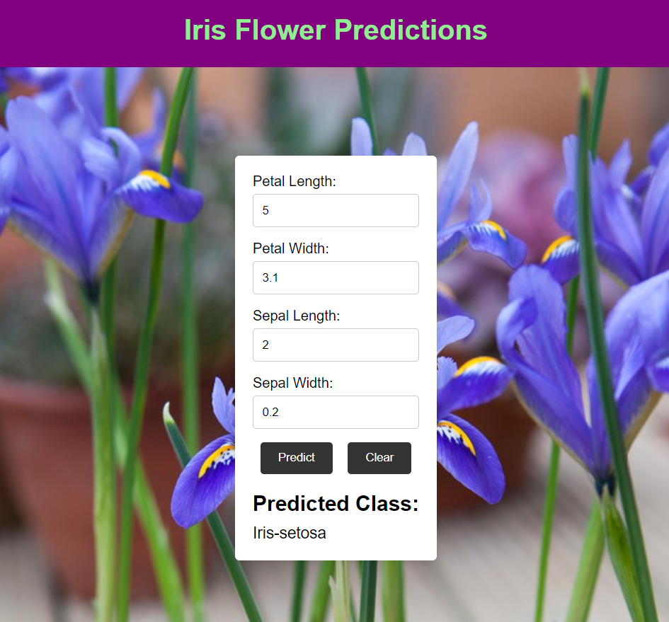

# Iris Flower Species Prediction - Flask Web App

## Overview

This project is a web application built using Flask that predicts the species of an Iris flower based on its petal and sepal measurements. The app uses a trained machine learning model (Random Forest Classifier) to make predictions. Users can input the petal length, petal width, sepal length, and sepal width, and the app will return the predicted species based on the .csv file used to train the model.

## Features

- **Iris Flower Prediction**: Users input the petal and sepal dimensions, and the model predicts the flower species.
- **Machine Learning Model**: The app uses a pre-trained Random Forest Classifier model to make predictions.
- **Web Interface**: A user-friendly web interface built using Flask.
- **Training & Preprocessing Scripts**: Scripts to preprocess the data, train the model, and store the trained model for use in the Flask app.

  

## File Descriptions

- **`flask_app.py`**: The main Flask application that renders the form for input and shows the prediction result.
- **`prepare_data.py`**: Script to load and preprocess the Iris dataset, splitting it into training and testing sets.
- **`train_model.py`**: Script to train the Random Forest model and save it as a pickle file for later use.
- **`iris_model.pkl`**: The pre-trained model stored as a pickle file.
- **`iris.png`**: Image demonstrating the site interface where users can input their data and get a prediction.

## How It Works

1. **Input**: Users enter the measurements for petal length, petal width, sepal length, and sepal width in the web form.
2. **Prediction**: The app loads a pre-trained machine learning model, processes the input, and predicts the species of the Iris flower.
3. **Output**: The predicted species is displayed on the same page.

## How to Use

### 1. Clone the repository
   ```bash
   git clone https://github.com/bonkooo/iris-flower-prediction.git
   cd iris-flask-app
   ```
### 2. Prepare the data
   ```bash
   python prepare_data.py
   ```
### 3. Train the model
   ```bash
   python train_model.py
   ```
### 4. Run the Flask app
   ```bash
   python flask_app.py
   ```
The app will be hosted on http://127.0.0.1:5000/.
